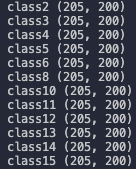

# Indian Pines

## データの読み込み
`load_path`は，自分がこのデータセットを保存しているディレクトリのパスを指します．
```
import numpy as np
import scipy.io as sio

data = np.array(sio.loadmat(load_path + 'Indian_pines_corrected.mat')['indian_pines_corrected'])

target = np.array(sio.loadmat(load_path + 'Indian_pines_gt.mat')['indian_pines_gt'])
```

## クラス毎のピクセル数
- class0はラベル付けされていないピクセルなので，実験では使いません．


## 実験で使うクラスの選択
- 「クラス毎のピクセル数」に添付した画像のclass13のピクセル数（205）に他のクラスも合わせるため，ランダムにピクセルを選択しました（重複がないように選択します）．
- 205ピクセル未満のクラスは実験で使いません．
- 一例として，`numpy.random.choice()`は重複なしでピクセルを取り出せると思います．


- もし，実験で使うクラスの選択を終えた際に以下のような出力ならば



- このように変えてください．


## データセット分割
- 学習用：検証用：評価用＝6：2：2で分割した時のそれぞれのデータ数です．


