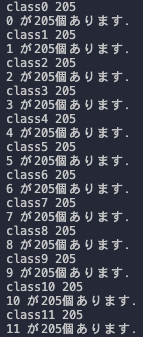
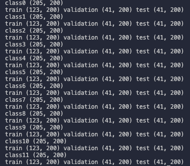
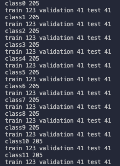
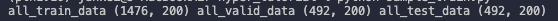

# Hyper Tutorial

## 「データの読み込み」〜「Pytorchに対応させる」を自分でやる．
### データの読み込み

- Indian Pines（IP）とBotswana（BW）のデータの詳細は，それぞれ`IP.md`，`BW.md`
を参考にしてください．

### ハイパースペクトル画像からラベル付けされた画素を全て取り出す．
- `IP.md`，`BW.md`で読み込んだ`target`を参考にして，ラベル付けされた画素を全て取り出してください．

### 使わないクラスを除く
- こちらも`IP.md`，`BW.md`を参照してやってみてください．

### データにラベル付けする
- 使わないクラスを除いた後のデータにラベル付けします．
- `class`の次に来る番号を参考にラベル付けした`list`を用意してください．　
- `class0`ならそのデータに対応するラベルは`0`とし，ラベルの個数はデータ数と同じにします．`class0`のデータ数が`205`なら，対応するラベルは`205`個の`0`を含む配列になります．
- 添付した画像はIndian Pinesの例です．



### データセットを学習（Train）・検証（Validation）評価（Test）に分割する
- ネットワークを学習させる前にデータセットを学習用・検証用・評価用に分割します．  
- データとラベルも同じように分割してください．
- 分割する時の比率は，学習用：検証用：評価用＝6：2：2でお願いします．  
- 添付した画像はIndian Pinesの例です．

データの分割



ラベルの分割


- 最後にデータとラベルの学習用・検証用・評価用をそれぞれ一つの`ndarray`や`list`にまとめてください．

データを訓練用・検証用・評価用にまとめた例



ラベルを訓練用・検証用・評価用にまとめた例


### PyTorchに入力できるようにする

```
python train.py
```

### 評価（Test）
```
python evaluate.py
```